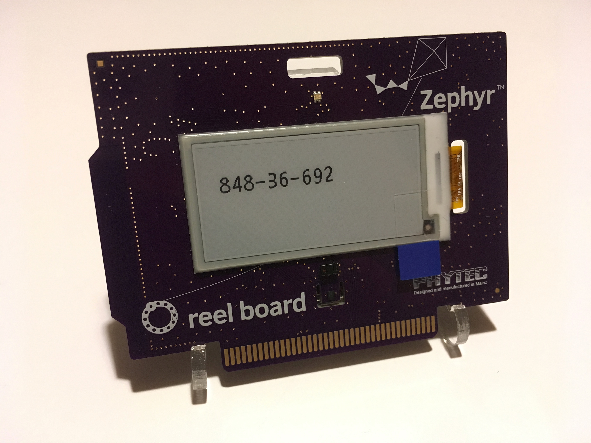
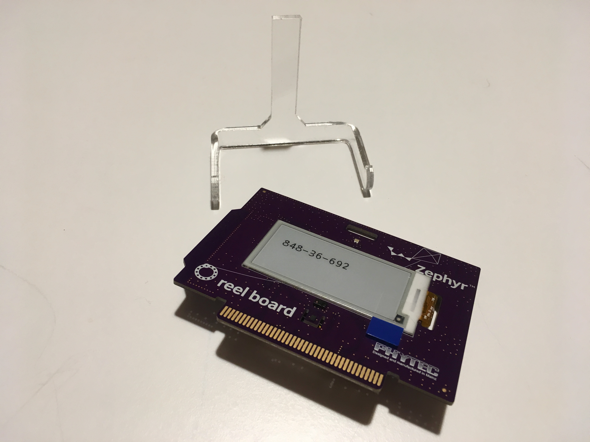

# Acrylic stand for the PHYTEC reel board

A small, acrylic table top stand for the [PHYTEC reel board](https://www.phytec.de/reelboard).

## Instructions
1. Load up the `reel_board_stand.scad` file in [OpenSCAD](http://www.openscad.org)
2. Export to a format understood by your favorite laser cutter
3. Cut the stand from e.g. 3 mm acrylic plate
4. Using a hot air gun, gently heat the legs of the stand on the middle and bend them to form the shape of the stand

